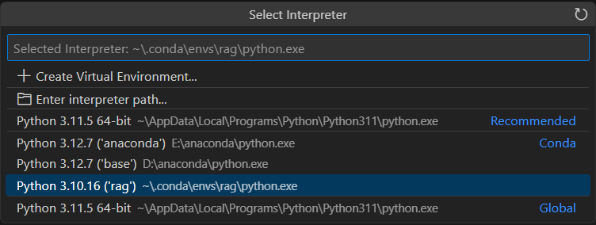

# RAGNavigator

本项目最初由邓凯元开发，旨在示例如何基于本地 CSV 数据生成 FAISS 向量数据库，并结合 Embedding 模型与 Re-ranker 完成文本搜索、重排、数据库查询和结果分析等功能。此项目在邓凯元的基础上，由本人进行了改造和扩展，以满足更广泛的应用需求。

## 目录结构

（其余内容保持不变）

---

这样就能清楚地标明项目的第一作者和您的改造工作。如果您还需要进一步调整或补充，请告诉我！

## 目录结构

```
my_project/
├── README.md                # 项目说明文档
├── requirements.txt         # Python依赖列表
├── data/                    # 存放所有数据相关文件
│   ├── input.csv            # 原始CSV文件(用户手动放置)
│   ├── input.xlsx           # 示例原始Excel文件(可选)
│   └── faiss_all_acge/      # FAISS向量库文件夹(项目自动生成或更新)
│       ├── files/           # 存放已导入向量库的源文件副本
│       │   └── input.csv    # 由脚本拷贝过来的文件
│       ├── index.faiss      # FAISS索引文件
│       └── index.pkl        # FAISS索引辅助文件
├── src/                     # 项目的主要源码文件
│   ├── config.py            # 配置脚本
│   ├── download_model.py    # 模型下载脚本
│   ├── embedding.py         # 嵌入模型封装
│   ├── get_answer.py        # 检索+重排+数据库等逻辑
│   ├── make_vector_db.py    # 构建、增量更新、删除向量数据库
│   ├── main.py              # 主运行脚本
│   └── ...
└── tests/                   # 单元测试或集成测试(可选)
    └── ...
```

> 若你的实际工程结构略有不同，请在使用时做相应的路径调整。

---

## 1. 功能概述

1. **模型下载**  
   通过 `download_model.py` 从 [ModelScope](https://modelscope.cn/) 下载所需的文本 Embedding 模型（如 `yangjhchs/acge_text_embedding`）和重排模型（如 `BAAI/bge-reranker-v2-m3`）到本地缓存。

2. **构建向量数据库**  
   运行 `make_vector_db.py`，将 `data/input.csv` 中的文本分块后，计算 Embedding 并存储在 FAISS 索引文件 (`index.faiss`, `index.pkl`) 中。这些文件会保存在 `faiss_all_acge` 文件夹下。

3. **检索与重排**  
   在 `get_answer.py` 中，通过向量检索 (FAISS) 找到最相似的文本块，再结合重排模型 (Re-ranker) 对结果进行进一步排序，得到最相关的文本片段。

4. **数据库查询与结果分析**  
   将检索到的 UUID 信息发送给 PostgreSQL 等数据库执行查询，并利用 LLM (例如 `ChatOpenAI` 或自定义 API) 进行过滤排序或生成更人性化的结果。

5. **主运行流程**  
   通过 `main.py` 来串联上述所有步骤，实现从输入 Query 到最终结果的一体化处理。

---

## 2. 安装依赖

下面先介绍**直接使用 pip** 安装的方式；如果你需要使用 **Conda** 环境（尤其是名为 `rag` 的环境），请参考后续 [2.1 Conda 环境配置](#21-conda-环境配置) 的步骤。

### 2.0 直接使用 pip

```bash
pip install -r requirements.txt
```

这会安装所需 Python 包，包括但不限于：
- `langchain`
- `langchain_community`
- `modelscope`
- `sentence_transformers`
- `psycopg2`（如需连接 PostgreSQL）
- 以及其他通用依赖。

如遇到版本冲突，请结合报错信息手动修改。

### 2.1 Conda 环境配置

若想在 VS Code 中使用 Conda 的 `rag` 环境来隔离并管理项目依赖，可按以下步骤进行：

1. **创建并激活 `rag` 环境**  
   ```bash
   # 在命令行中执行
   conda create -n rag python=3.10
   conda activate rag
   ```
   > 这里指定了 `python=3.10`，你也可以根据需要选择其他版本（如 3.9、3.11 等）。

2. **安装依赖**  
   在激活的 `rag` 环境下，执行：
   ```bash
   pip install -r requirements.txt
   ```
   这样就可以将所有依赖包装进 `rag` 环境。

3. **VS Code 中选择 `rag` 解释器**  
   - 打开 VS Code 后，按 `Ctrl + Shift + P`（Windows）或 `Cmd + Shift + P`（macOS），输入“Python: Select Interpreter”并回车；  
   - 在弹出的选项里，选择 `...\conda\envs\rag\python.exe`（见下图所示）；  
   - 确保 VS Code 的“终端”或“调试”使用的解释器都是这个 `rag` 环境，之后运行脚本就会使用已安装的依赖。

*图片仅作示例，实际路径以你本地环境为准。*

---

## 3. 使用方法

### 3.1 下载模型

```bash
cd src
python download_model.py
```

执行成功后，将在本地 `~/.cache/modelscope/hub/...` 等目录下载并缓存指定模型。

### 3.2 构建向量数据库

1. **准备数据**  
   将你的原始 CSV 文件（例如 `input.csv`）放到 `data/` 目录下。  
   > **注意**：`data/input.csv` 是**原始的** CSV 数据。

2. **执行脚本**  
   ```bash
   cd src
   python make_vector_db.py
   ```
   - 脚本会将 `data/input.csv` 读入、进行 Embedding，并在 `data/faiss_all_acge/` 下生成：
     - `index.faiss`, `index.pkl` 等文件（真正存储向量索引的二进制和辅助文件）。
     - 将原始 `input.csv` **复制**到 `data/faiss_all_acge/files/` 文件夹中，用于记录哪些数据已导入索引。  
   - 也因此，你会看到项目中出现**两个 `input.csv`**，它们分别是：
     1. `data/input.csv`：**原始 CSV**（你自己放的）
     2. `data/faiss_all_acge/files/input.csv`：**被脚本拷贝过来的副本**（仅用于标记已成功导入的文件）  
   - **`index.faiss` 和 `index.pkl`** 才是真正的**向量库**文件，用于 FAISS 相似度搜索。

### 3.3 主脚本运行

```bash
cd src
python main.py
```

- 该脚本中示例演示了如何对某些 `query_dict` 进行近义词扩展 (`analyze_query`)、向量检索 (`get_knowledge_based_answer`)、数据库查询 (`query_uuid`) 以及结果排序 (`analyze_sql_results2`) 等操作。  
- 最终结果会打印在命令行中。

### 3.4 其他操作
- **增量添加 CSV 文件**  
  ```python
  from make_vector_db import add_to_knowledge_vector_db
  add_to_knowledge_vector_db("data/faiss_all_acge", "data/new_data.csv")
  ```
  这将把新文件 `new_data.csv` 读取并添加至已有向量库，并拷贝到 `files/` 文件夹。

- **删除已导入的文件**  
  ```python
  from make_vector_db import delete_file_from_knowledge_vector_db
  delete_file_from_knowledge_vector_db("data/faiss_all_acge", "data/input.csv")
  ```
  这将在向量库索引和 `files` 文件夹中删除对应内容。

---

## 4. 常见问题

1. **为什么有两个 `input.csv`？**  
   - `data/input.csv` 是**原始文件**，由用户放置或生成；  
   - `data/faiss_all_acge/files/input.csv` 是**被脚本拷贝过去的文件**，用于追踪已导入索引的文件列表；  
   - 真正用于相似度搜索的是 `index.faiss`、`index.pkl` 等二进制或序列化文件。

2. **向量库在何处？**  
   - `data/faiss_all_acge/index.faiss` 和 `data/faiss_all_acge/index.pkl`。  
   - 只要脚本或系统能正确加载这两个文件，就能进行相似度检索。

3. **模型下载失败或速度慢**  
   - 如果下载失败或速度过慢，可手动下载模型后放到 `~/.cache/modelscope/hub/...` 下对应的目录。  
   - 若你有镜像源或代理，可以在 `config.py` 或系统网络设置中配置。

4. **数据库连接出错**  
   - 请确保数据库（如 PostgreSQL）已启动，并在 `get_answer.py` 或 `config.py` 中的连接参数正确。

5. **依赖冲突**  
   - 修改 `requirements.txt` 中的版本或单独安装特定版本的包，例如：  
     ```bash
     pip install langchain==0.0.XX
     ```

---

## 5. 总结

- 本项目演示了一个从**文本数据**到**向量检索**再到**数据库查询**与**LLM 分析**的完整流程。  
- 读者可根据自身需求进行个性化扩展，比如换用其他 Embedding 模型、改用不同数据库、添加更多数据过滤逻辑等。

如有更多问题，欢迎在 Issue 进行反馈或进行个性化定制。
